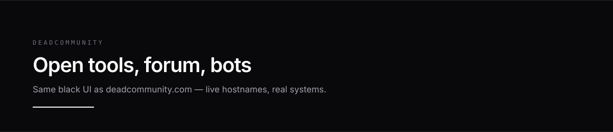
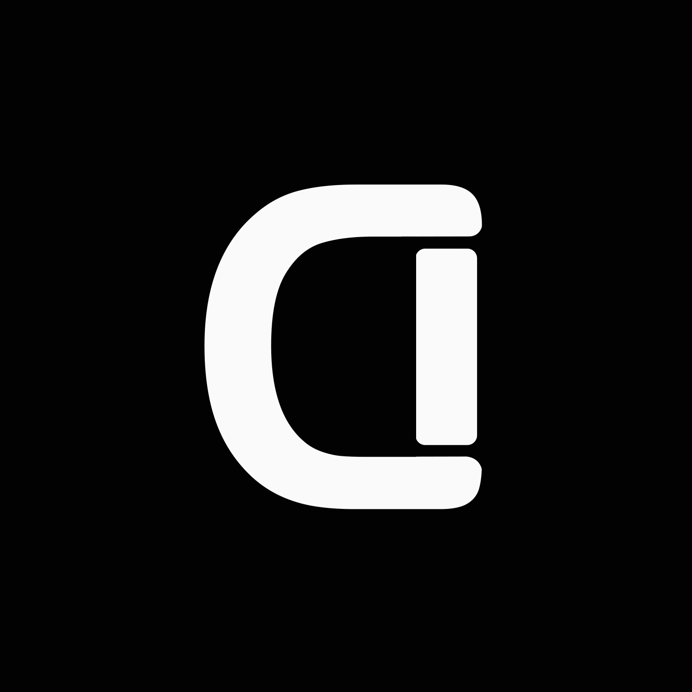

<div align="center">
  
  <br/><br/>
  
  <h1>Semaru</h1>
  <p>
    <code>DEADCOMMUNITY</code>
    &nbsp;·&nbsp;
    Istanbul
    &nbsp;·&nbsp;
    Builder &amp; operator
  </p>
  <p>
    <a href="https://deadcommunity.com"></a>
    <a href="https://github.com/Semaru47/deadcommunity-showcase"></a>
    <a href="https://twitter.com/Semaru47"></a>
  </p>
</div>

<p align="center">
  
</p>

### Summary

I design, ship, and run **DeadCommunity** — a self-hosted ecosystem of web apps, Discord bots, and infrastructure under one black-UI brand ([deadcommunity.com](https://deadcommunity.com)).

Public repositories here are **product cards** (purpose, live URL, stack). Production source and secrets stay private. If a hostname is listed, it was running when published.


### Selected work

Six surfaces that best represent the system. Each links to a detailed English showcase.

| Product | What it is | Live | Card |
|:--------|:-----------|:-----|:-----|
| **DeadCommunity Web** | Brand site + CMS platform | [deadcommunity.com](https://deadcommunity.com) | [repo](https://github.com/Semaru47/deadcommunity-web) |
| **DeadForum** | Community forum | [forum…](https://forum.deadcommunity.com) | [repo](https://github.com/Semaru47/deadcommunity-forum) |
| **Dead Anime** | Anime Discord bot + web hub | [anime…](https://anime.deadcommunity.com) | [repo](https://github.com/Semaru47/deadcommunity-anime) |
| **Dead Music** | Music bot + operator dashboard | [music…](https://music.deadcommunity.com) | [repo](https://github.com/Semaru47/deadcommunity-music) |
| **Dead Boss** | Community ops bot + admin panel | [boss…](https://boss.deadcommunity.com) | [repo](https://github.com/Semaru47/deadcommunity-boss) |
| **deadPDF** | Browser PDF utility suite | [pdf…](https://pdf.deadcommunity.com) | [repo](https://github.com/Semaru47/deadcommunity-pdf) |


### Product lines

**Tool shelf** — same set as the homepage explorer  
[deadPDF](https://github.com/Semaru47/deadcommunity-pdf) · [deadVideo](https://github.com/Semaru47/deadcommunity-video) · [deadSound](https://github.com/Semaru47/deadcommunity-sound) · [deadImage](https://github.com/Semaru47/deadcommunity-image) · [deadQR](https://github.com/Semaru47/deadcommunity-qr) · [deadColor](https://github.com/Semaru47/deadcommunity-color) · [deadDiff](https://github.com/Semaru47/deadcommunity-diff) · [deadPaste](https://github.com/Semaru47/deadcommunity-paste) · [deadSummarize](https://github.com/Semaru47/deadcommunity-summarize)

**Founders**  
[Portfolio — Malik](https://github.com/Semaru47/deadcommunity-portfolio-malik) ([live](https://malik.deadcommunity.com)) · [Portfolio — Utku](https://github.com/Semaru47/deadcommunity-portfolio-utku) ([live](https://utku.deadcommunity.com))

**Infrastructure**  
[Contact / Matrix](https://github.com/Semaru47/deadcommunity-contact) · [Drive](https://github.com/Semaru47/deadcommunity-drive) · [Hub](https://github.com/Semaru47/deadcommunity-hub) · [Bounty](https://github.com/Semaru47/deadcommunity-bounty) · [Games](https://github.com/Semaru47/deadcommunity-games) · [Indirim bot](https://github.com/Semaru47/deadcommunity-indirim)

**Index** — [deadcommunity-showcase](https://github.com/Semaru47/deadcommunity-showcase)


### Operating model

```text
scope  →  build  →  containerize  →  publish hostname  →  observe & iterate
```

| Principle | Practice |
|:----------|:---------|
| Own the path | UI, API, data, deploy, and uptime on one team |
| Prefer live proof | Public URL over slide decks |
| Separate surfaces | Public cards ≠ private source |
| Match the brand | Black UI, white mark, mono labels — same as the site |


### Stack

`Next.js` · `TypeScript` · `Django` · `Node` · `Python` · `PostgreSQL` · `Redis` · `Docker` · `Nginx` · `Cloudflare Tunnel` · `Discord API` · `Matrix` · `Ollama`

<p align="center">
  
</p>

<div align="center">
  
  <br/><br/>
  <p><strong>Build it. Host it. Keep it black and online.</strong></p>
  <p>
    <a href="https://deadcommunity.com"></a>
    <a href="https://github.com/Semaru47/deadcommunity-showcase"></a>
  </p>
  <sub>Brand: DeadCommunity · Profile: Semaru</sub>
</div>
