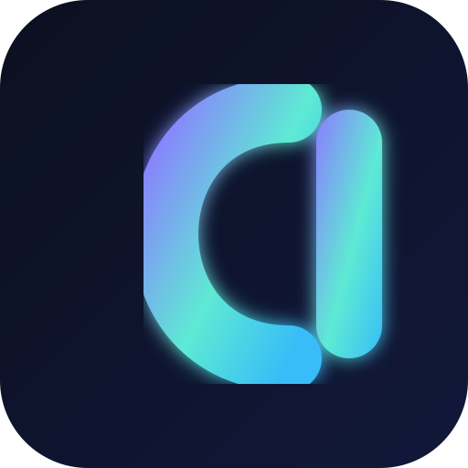

<div align="center">


<br/>



# Semaru

### Builder behind [DeadCommunity](https://deadcommunity.com)

Istanbul-based full-stack operator. I do not stop at mockups — I ship **live hostnames**, keep containers healthy, and iterate on real users.

<a href="https://deadcommunity.com">
  
</a>
<a href="https://github.com/Semaru47/deadcommunity-showcase">
  
</a>
<a href="https://twitter.com/Semaru47">
  
</a>


</div>

---

## Why this profile looks like a product shelf

Most GitHub profiles list unfinished ideas. Mine lists **systems that answer on a public URL today**.

Each `deadcommunity-*` repository is a **product card** (role, live link, stack overview).  
Source code and secrets stay private — the public side is proof of shipping, not a code dump.

| You want… | Go here |
|-----------|---------|
| Brand + CMS site | [deadcommunity.com](https://deadcommunity.com) |
| Everything indexed | [deadcommunity-showcase](https://github.com/Semaru47/deadcommunity-showcase) |
| Founder portfolios | [malik](https://malik.deadcommunity.com) · [utku](https://utku.deadcommunity.com) |


## What I actually run

<table>
<tr>
<td width="50%" valign="top">

### Platforms
Color: violet lane

| | |
|--|--|
| **Web** | Next.js + Django CMS brand site |
| **Forum** | Community forum on its own hostname |
| **Portfolios** | Founder sites for Malik & Utku |

Repos: [web](https://github.com/Semaru47/deadcommunity-web) · [forum](https://github.com/Semaru47/deadcommunity-forum)

</td>
<td width="50%" valign="top">

### Discord fleet
Color: teal lane

| | |
|--|--|
| **Anime** | Bot + web hub |
| **Music** | Bot + dashboard |
| **Boss** | Community ops bot + panel |
| **Indirim** | Deals / discount bot |

Repos: [anime](https://github.com/Semaru47/deadcommunity-anime) · [music](https://github.com/Semaru47/deadcommunity-music) · [boss](https://github.com/Semaru47/deadcommunity-boss)

</td>
</tr>
<tr>
<td width="50%" valign="top">

### Tool suite
Color: sky lane

PDF · Video · Sound · Image · QR · Color · Diff · Paste · Summarize · Bounty

Open any `deadcommunity-pdf` style repo for the full English card + live URL.

</td>
<td width="50%" valign="top">

### Own the infra
Color: mint lane

Matrix / Element / LiveKit · Drive · Hub · Minecraft & Palworld · Cloudflare Tunnel edge

Repos: [contact](https://github.com/Semaru47/deadcommunity-contact) · [games](https://github.com/Semaru47/deadcommunity-games)

</td>
</tr>
</table>


## How a DeadCommunity product is born

```text
  idea  ──►  UI / API  ──►  Docker on our host  ──►  Tunnel hostname  ──►  keep it up
```

1. **Shape the product** — who uses it, what “done” means on a phone and a desktop.  
2. **Build the stack** — web UI, bots, databases, reverse proxy as needed.  
3. **Ship on metal we control** — containers, health checks, backups where it matters.  
4. **Publish a public card** — English README + live link, without leaking source.

That loop is why the logo sits on this profile: the network mark is not decoration — it is the map of services talking to each other under one brand.


## Daily toolkit

<p align="center">
  
  
  
  
  
  
  
  
  
  
  
  
</p>


## Featured live lanes

| Lane | Color cue | Jump in |
|------|-----------|---------|
| Brand | Violet | [deadcommunity.com](https://deadcommunity.com) |
| Forum | Indigo | [forum.deadcommunity.com](https://forum.deadcommunity.com) |
| Anime | Teal | [anime.deadcommunity.com](https://anime.deadcommunity.com) |
| Music | Cyan | [music.deadcommunity.com](https://music.deadcommunity.com) |
| PDF tools | Sky | [pdf.deadcommunity.com](https://pdf.deadcommunity.com) |
| Portfolios | Mint | [malik](https://malik.deadcommunity.com) · [utku](https://utku.deadcommunity.com) |

<details>
<summary><strong>All public showcase repositories</strong></summary>

<br/>

[web](https://github.com/Semaru47/deadcommunity-web) ·
[forum](https://github.com/Semaru47/deadcommunity-forum) ·
[pdf](https://github.com/Semaru47/deadcommunity-pdf) ·
[video](https://github.com/Semaru47/deadcommunity-video) ·
[sound](https://github.com/Semaru47/deadcommunity-sound) ·
[image](https://github.com/Semaru47/deadcommunity-image) ·
[qr](https://github.com/Semaru47/deadcommunity-qr) ·
[color](https://github.com/Semaru47/deadcommunity-color) ·
[diff](https://github.com/Semaru47/deadcommunity-diff) ·
[paste](https://github.com/Semaru47/deadcommunity-paste) ·
[summarize](https://github.com/Semaru47/deadcommunity-summarize) ·
[anime](https://github.com/Semaru47/deadcommunity-anime) ·
[music](https://github.com/Semaru47/deadcommunity-music) ·
[boss](https://github.com/Semaru47/deadcommunity-boss) ·
[indirim](https://github.com/Semaru47/deadcommunity-indirim) ·
[bounty](https://github.com/Semaru47/deadcommunity-bounty) ·
[drive](https://github.com/Semaru47/deadcommunity-drive) ·
[hub](https://github.com/Semaru47/deadcommunity-hub) ·
[contact](https://github.com/Semaru47/deadcommunity-contact) ·
[games](https://github.com/Semaru47/deadcommunity-games) ·
[portfolio-malik](https://github.com/Semaru47/deadcommunity-portfolio-malik) ·
[portfolio-utku](https://github.com/Semaru47/deadcommunity-portfolio-utku) ·
[showcase index](https://github.com/Semaru47/deadcommunity-showcase)

</details>

---

<div align="center">


<br/><br/>

**Build it. Put a hostname on it. Keep it alive.**

<br/>

<a href="https://deadcommunity.com">
  
</a>
&nbsp;
<a href="https://github.com/Semaru47?tab=repositories&q=deadcommunity-">
  
</a>

<br/><br/>

<sub>Logo & brand: DeadCommunity · Profile operator: Semaru · Istanbul</sub>

</div>
